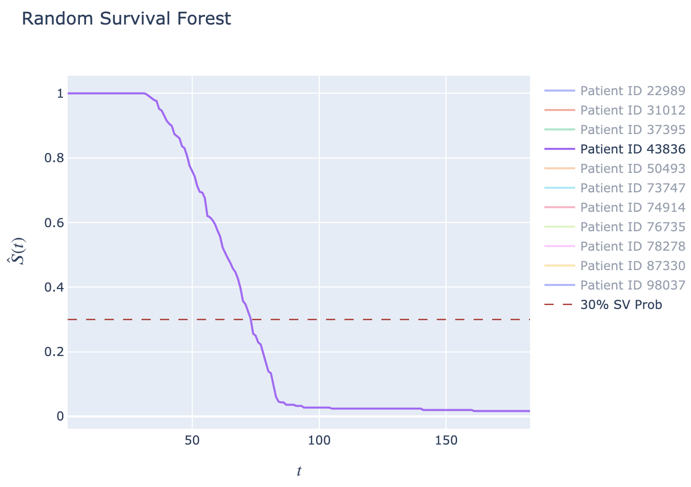
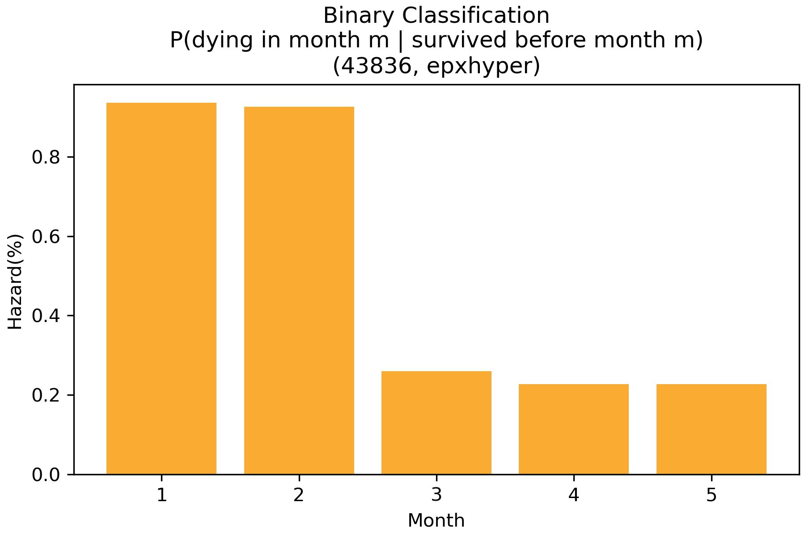
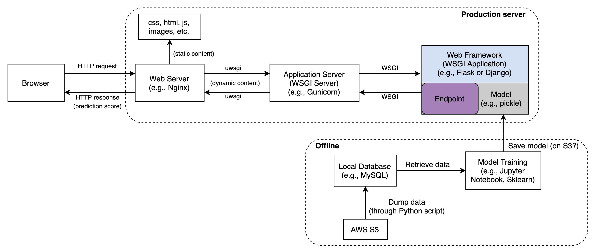
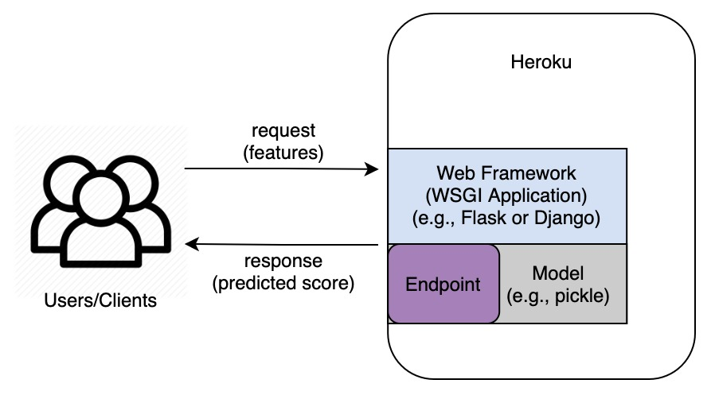
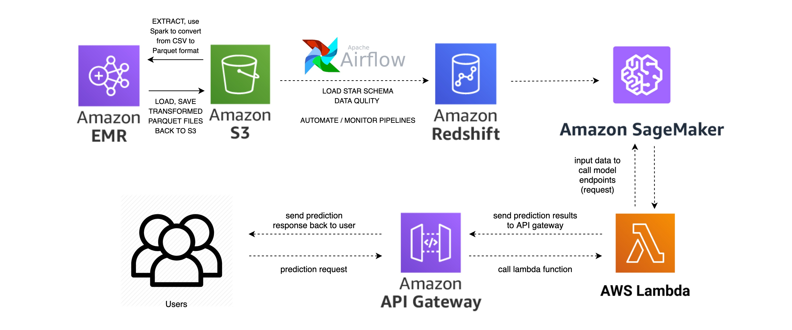

# Model Deployment[Draft]

### Problem Statement

At the beginning, we'd love to use survival analysis to model the engaging time of patients, but then realized that the predictions were not so convincing (maybe the traditional hazard-based models like CPH are not designed to make predictions but rather to make inference), which leads to the problem reformulation from traditional survival analysis **back** to binary classification plus a specific way of formatting the dataset.

The very first engagement model only focuses on predicting the probability of dropping off at the 5th week after patients' start dates, while the new survival model predicts the conditional probability of a patient dying in a particular month **given** the patient survived until then (this is exactly the hazard rate in survival analysis, see the comparison below)

<p align="center">
   
</p>

<p align="center" stype="color:blue">
  <span style="color:blue;"}>[ingore all the details about the model building which will be a huge part of explainations]</span>
</p>

Now, the goal for this project is to deploy the new survival model into production to apply it into real-world applications. 

### ML Systems Architecture
1. Main parts from a high level:  
  a. Data Layer: access to all data sources required by the model.  
  b. Feature Layer: transform source data into structured dataset that can be used for the model.  
  c. Scoring Layer: use saved scikit-learn model to make predictions based on input user data.  
  d. Evaluation Layer: monitor the model prediction results on the new unseen data based on certain metrics, compare the online and offline predictions.  
2. Two main ways for deploying the model:  
  a. Create a callable api. (a web application as an api)  
  b. Call the model through a Flask web app so that every user can use this web app to get the prediction generated from the backend saved model. (extension of a.)  
3. Deployment options:  
  a. on-premises  
  b. Infrastructure as a Service(IaaS): AWS EC2, Azure  
  c. Plarform as a Service(PaaS): Heroku  
  d. Function as a Service(FaaS): Lambda Functions(AWS); Cloud Functions(GCP)

### ELT Pipelines
Would like to treat this as ELT pipelines since the transformation is done after loading the data into production database. SQL queries for gathering data are ready to use, and some intermidiate tables are generated. May need to further optimize query syntax to speed up execution process, though query has been optimized for several times till now.

if(models as web endpoints):
- Write separate sql queries for training and prediction
- Connect to the production databse directly through Python to create intermediate tables.

if(models as serverless functions):
- #TODO

### ML Pipelines
Need to build the ml pipelines for the new survival model as well as to ensure reproducibility in the part of data sources gathering, feature engineering, model building, prediction, and model deployment. Pipelines will be built likely into a custom library (need more discusstions here) along with some other useful functions. Currently, I've written 4 methods into a class named as CareSignal.
- Model loading: models are saved into pickle files
- Feature engineering: apply transformations to the unseen data.
- Prediction: load the saved models along with other necessary saved transformers to make predictions based on unseen data.
- Inference: results interpretations and feature understandings will be made after predictions to serve as an inference or visualize on the webpage.

### Model as a Web Endpoint
- Set up a web service:  
  Use Flask(considered) or Django(not considered) to build the web application to return predictions based upon the passed-in user data. Then, run the service on either (1) an EC2 instance or (2) the local machine.  
  - If host the web service on an EC2 instance, then it can be called on the open web using the public IP of that EC2 instance.  
    E.g., #TODO
  - If host the web service on local machine, then it won't be accessible over the web.  
    E.g., save the Flask app as a Python script called something like `app.py`, launch it via `python3 app.py` on the command line, then browse the result via http://localhost:5000  
- Model persistence:  
  Instead of train the model within the web application, load the saved model within the web app. Methods that can be used for saving the models include:  
  a. Pickle - may run into issues when the execution environment is different from production environment;  
  b. MLflow - make models more portable, model training environment does not need to match deployment environment;  
  c. Keras - this is for saving and loading DL models.  
- Model endpoints:  
  After loading the pre-trained model and saved scalers through one of the above methods, make predictions by calling `predict_proba(new_x)` on loaded model object.  
- Call the service:  
  If serve it as a callable API, then create a route view that will accept the API json request and return back a prediction. E.g., `@app.route("/api/engagement, method=["POST"])`, test it in postman. If use the requests programmatically, then use `requests` library and do `requests.post("http://localhost:5000/api/engagement", json=user_data_in_json_format)`.  

### Live deployment:  
  For now, we've been running this Flask web app on the local machine. Next step is to deploy it in the cloud so that everyone can access the website 24/7. There are several ways to deploy and host the Flask web app.
  > Development Server vs Production Server: The difference between the two is largely a matter of security. Typically, a server in a development environment allows unrestricted access to and control by a user or group of users. A production server, on the other hand, is configured to restrict access to authorized users and to limit control to system administrators. For example, in a development environment anyone might be allowed to shut down the server, whereas, in a production environment, only an administrator with appropriate privileges would be allowed to stop a running server.  

  - Option 1: Nginx + Gunicorns + Flask(API), on Ubuntu
    
  - Option 2: Gunicorn + Flask(API), on Heroku (PaaS)  
  Only need to take care of application and data part, without much custimization of the architecture.And, the app is running 24/7.
  ```
    ├── FlaskAPI
    │   ├── __pycache__/
    │   ├── models/
    │   │   ├── model.pkl
    │   │   └── scaler.pkl
    │   └── app/
    │       └── run.py
    ├── wsgi.py 
    ├── .gitignore
    ├── Procfile ------------------ # revise Flask application's Procfile to use Gunicorn
    └── requirements.txt 
  ```
    
  - Option 3: Gunicorn + Flask(API), on VM (AWS EC2 - IaaS)(?)  
  - Option 4: Serverless (FaaS)  
  Instead of Heroku which manages all the server stuff for us but our applications keep running all the time in Heroku's cloud. For serverless, applications are only running when someone needs to use it, and the rest of the time it's just sleeping.  
    - AWS, lambda functions + API gateway(?):  
      

  - Option 5: Docker  
    #TODO  
